# Touch Portal Plugin for Open Hardware Monitor

TouchPortal Plugin to Utilize Statistics from Open Hardware Monitor - for Windows

- [Touch Portal Plugin for Open Hardware Monitor](#touch-portal-plugin-for-open-hardware-monitor)
  - [Current Sensors and Values Available](#current-sensors-and-values-available)
      - [CPU](#cpu)
      - [RAM](#ram)
  - [Sample Page](#sample-page)
  - [Events](#events)
    - [CPU Total Status](#cpu-total-status)
    - [Memory Status](#memory-status)
  - [Getting Started](#getting-started)
    - [Prerequisites](#prerequisites)
    - [Installing](#installing)
    - [Updating](#updating)
  - [Troubleshooting](#troubleshooting)
  - [Notes](#notes)
  - [Built With](#built-with)
  - [Versioning](#versioning)
  - [Authors](#authors)
  - [License](#license)
  - [Acknowledgments](#acknowledgments)

## Current Sensors and Values Available

These are the current sensors and values available via this plugin. There are many more to consider, but this was the first go at it. This information will be transmitted back to Touch Portal every 2 seconds. If this becomes a problem I'll probably extract this out into a configuration file so it can be controlled by you.

#### CPU

- **Total CPU Load** - Will output the raw current percentage (to 1 decimal point) of CPU Load
  - state id is `tpohm_cpu_total_load_val`
    - Values are: 0.0 - 100.0
- **CPU Status** (based on Total Load) - called a Threshold in the code
  - state id is `tpohm_cpu_total_load_status`
    - Final Values are: `Low, Medium, High`
      - `Low` is when &lt; 45% of CPU is used
      - `Medium` is when &lt; 85% of CPU is used
      - `High` is when &gt;= 85% of CPU is used

#### RAM

- **Total Memory Load** - output the raw current percentage (to 1 decimal point) of Memory Load
  - state id is `tpohm_memory_load_val`
    - Values are: 0.0 - 100.0
- **Memory Status** (based on Total Load) - called a Threshold in the code
  - state id is `tpohm_memory_load_status`
    - Final Values are: `Low, Medium, High`
      - `Low` is when &lt; 40% of Memory is used
      - `Medium` is when &lt; 85% of Memory is used
      - `High` is when &gt;= 85% of Memory is used

## Sample Page

I have created a sample page that can be imported directly into Touch Portal and consume all 4 possible values.
Download and import this page: [TP OHM Page](resources/OHM%20Page%20Example.tpz)

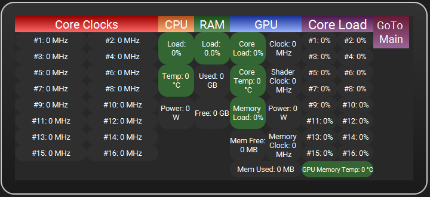

Here is a gif of it in action on my phone:

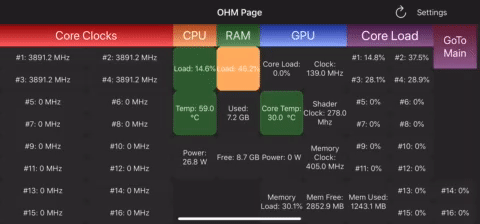

## Events

### CPU Total Status

This event is triggered off the state id `tpohm_cpu_total_load_status`

Example:

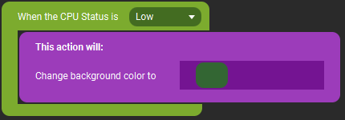

### Memory Status

This event is triggered off the state id `tpohm_memory_load_status`

Example:


## Getting Started

If you use [Touch Portal](https://touch-portal.com) and are interested in having a "dashboard" display of some base computer statistics, these instructions will help get that setup for you.

If you don't use Touch Portal - how dare you, you should!

### Prerequisites

Download and run Open Hardware Monitor - you can find it here: https://openhardwaremonitor.org/
Current tested version is 0.9.2

Location of where it is downloaded and run from do not matter, as long as it is running and writing sensor data it can run from anywhere on the computer.

After download, run the OpenHardwareMonitor.exe file, for this plugin to run correctly, please enable the following "Options" menu items:

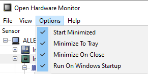

### Installing

_**NOTE**_: Default install path is %APPDATA%\TouchPortal\plugins\OpenHardwareMonitor and this install contains the entry.tp file that Touch Portal requires to load the plugin, IF you change your directory to outside the standard Touch Portal plugins folder. this will not work properly.

**Step 1** Download the installer [TP_OHM_Setup.exe](installer/TP_OHM_Setup.exe) file from the github repo. This will install everything needed for TouchPortal to recognize the plugin

**Step 2** Execute the installer program

**2.1** If you need to change directories click the "Options" button underneath "Install" (you can also disable shortcuts here if you want)

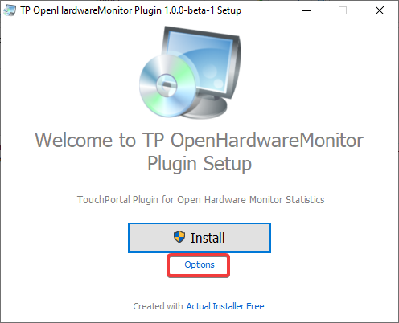

**Step 3** Click the 

**3.1** It should ask permission to install using UAC (if youhave that enabled) - click "Yes" button
if you don't see it immediately look on your task bar for this icon: 

**3.2** When it is complete you should see this, and click "Finish":

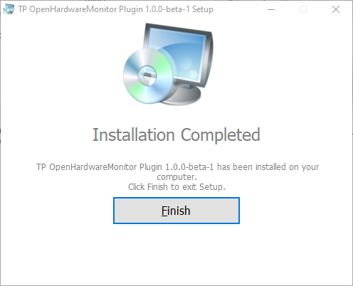

**Step 4** Now restart the Touch Portal app

**4.1** _**NOTE**_: Make sure you fully close Touch Portal using System Tray icon to exit

**Step 5** After Touch Portal is back open click on an empty button and if you scroll down in the "Add Actions" list, you should see:

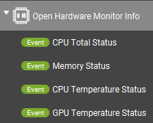

**Step 6** Now you can move onto the Sample Page or start creating your own buttons to use this data.

### Updating

The Install package has a built-in update executable to run when updates are released of TP Open Hardware Monitor Plugin.

**Step 1** If you didn't modify the default install you should see this in your Start Menu Program List

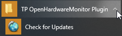

**1.1** If you do not see that, navigate to the location you installed the plugin to, and locate Updater.exe

**Step 2** Click "Check for Update" or execute Updater.exe depending on the steps above, and it will open this window

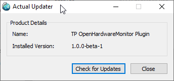

**Step 3** Click "Check for Updates" button or "Close" (obviously if you choose Close it will not update)

**Step 4** IF there are no updates available it will popup a window telling you so, and you can stop here. Click "Ok" and it will close the updater.

**Step 5** IF there _**IS**_ an update you should see something like this:

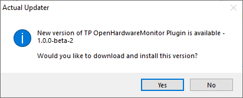

**Step 6** Click "Yes" button to download new version

**Step 7** It is going to open a web Browser (whichever is your default) to download the new installer

**7.1** in Chrome you may see this, just click the arrow and select "Keep"

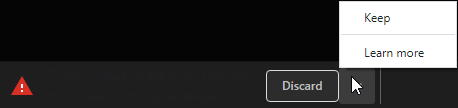

**Step 8** When the download is finished, run the new installer.

**Step 9** Windows may popup a window like this, go ahead and click 'More Info', and then click 'Run anyway'

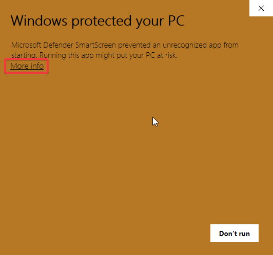 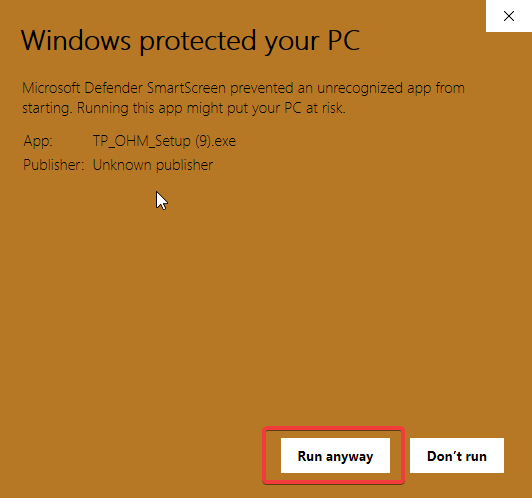

**Step 10** Since you are updating, it will ask you to uninstall the previous version, click "Yes"

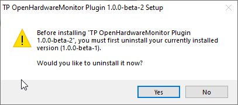

**Step 11** On the Are you sure prompt, click "Yes"

**Step 12** If Windows UAC pops up - click 'Ok'

**Step 13** For some reason if tp_ohm.exe is running, this uninstaller will not kill it, so go ahead and close Touch Portal, which will in turn cause the socket to disconnect, and the program will shut down. Then on the warning about closing previous application click "OK".

**Step 14** When it finishes uninstalling you should see a Success Message

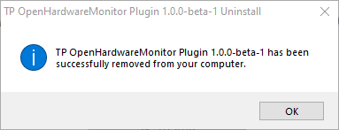

**Step 15** Now continue with the install like in the above initial install instructions. When it is complete start Touch Portal back up.

## Troubleshooting

Touch Portal will log that it attempted to load the plugin in it's log file
%APPDATA%\TouchPortal\log.txt

when it loads the Plugin it should look like this

```
00:48:02 - [LOG] (Plugin System) Searching and loading plugins...
00:48:02 - [LOG] (Plugin System) (127.0.0.1) Waiting for request on port 12136...
00:48:02 - [LOG] (Plugin System) Added Category: Open Hardware Monitor Info
```

and a little lower you should see something like this:

```
00:48:08 - [LOG] (Plugin System) Executing plugin service: "C:\Users\<USERNAME>\AppData\Roaming\TouchPortal\plugins\OpenHardwareMonitor\tp_ohm.exe"
```

There is also a logfile under the OpenHardwareMonitor plugin folder, %APPDATA%\TouchPortal\plugins\OpenHardwareMonitor\tpohm.log
if you see something like this

```
[ERROR] Unable to connect to WMI...
```

Verify you followed the Prequisite section and installed Open Hardware Monitor, otherwise your user may not have access to read from WMI - please follow [this link](https://docs.bmc.com/docs/display/public/btco100/Setting+WMI+user+access+permissions+using+the+WMI+Control+Panel), but for OpenHardwareMonitor folder instead of CIMV2 to set your user up to access WMI

If you do not see those messages - visit the #tp_ohm channel on the Touch Portal Discord and we can troubleshoot it when I'm available

_INFO: more notes will be added here as we have to troubleshoot_

## Notes

- this has only been tested on Windows 10 Pro, your mileage my vary
- this was tested on a single CPU Desktop machine, your mileage may vary.
- If you experience issues with the plugin please submit an issue with a saved copy of your Open Hardware Monitor report (File -> Save Report), and it will be reviewed as time permits

## Built With

- [StrawberryPerl](http://strawberryperl.com/) - Coding Language
- [PAR::Packaging](https://metacpan.org/pod/pp) - EXE Packaging Utility
- [Win32::OLE](https://metacpan.org/pod/Win32::OLE) - Used to access the WMI information
- [ActualInstaller(free)](https://www.actualinstaller.com/?vid=7.6) - Used to package program into installer and support Updating

## Versioning

We use [SemVer](http://semver.org/) for versioning. For the versions available, see the [tags on this repository](https://github.com/spdermn02/tpohm_plugin/tags).

## Authors

- **Jameson Allen** - _Initial work_ - [Spdermn02](https://github.com/spdermn02)

## License

This project is licensed under the GNU General Public License v3.0 - see the [LICENSE](LICENSE) file for details

## Acknowledgments

- Thank you to Open Hardware Monitor for writing your statstics somewhere accessible
- Thank you to Ty and Reinier for creating and developing Touch Portal
