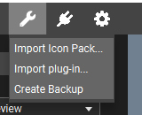
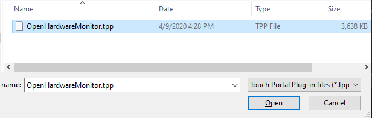
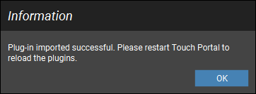

# Touch Portal Plugin for Open Hardware Monitor

TouchPortal Plugin to Utilize Statistics from Open Hardware Monitor - for Windows

## Current Sensors and Values Available

These are the current sensors and values available via this plugin. There are many more to consider, but this was the first go at it.  This information will be transmitted back to Touch Portal every 2 seconds.  If this becomes a problem I'll probably extract this out into a configuration file so it can be controlled by you.

#### CPU

* **Total CPU Load** - Will output the raw current percentage (to 1 decimal point) of CPU Load
  * state id is `tpohm_cpu_total_load_val`
    * Values are: 0.0 - 100.0
* **CPU Status** (based on Total Load) - called a Threshold in the code
  * state id is `tpohm_cpu_total_load_status`
    * Final Values are: `Low, Medium, High`
      * `Low` is when  &lt; 45% of CPU is used
      * `Medium` is when  &lt; 85% of CPU is used
      * `High` is when &gt;= 85% of CPU is used

#### RAM

* **Total Memory Load** - output the raw current percentage (to 1 decimal point) of Memory Load
  * state id is `tpohm_memory_load_val`
    * Values are: 0.0 - 100.0
* **Memory Status** (based on Total Load) - called a Threshold in the code
  * state id is `tpohm_memory_load_status`
    * Final Values are: `Low, Medium, High`
      * `Low` is when  &lt; 40% of Memory is used
      * `Medium` is when  &lt; 85% of Memory is used
      * `High` is when &gt;= 85% of Memory is used

## Getting Started

If you use [Touch Portal](https://touch-portal.com) and are interested in having a "dashboard" display of some base computer statistics, these instructions will help get that setup for you.

If you don't use Touch Portal - how dare you, you should!

### Prerequisites

Download and run Open Hardware Monitor - you can find it here: https://openhardwaremonitor.org/
Current tested version is 0.9.2

Location of where it is downloaded and run from do not matter, as long as it is running and writing sensor data it can run from anywhere on the computer.

After download, run the OpenHardwareMonitor.exe file, for this plugin to run correctly, please enable the following "Options" menu items:


### Installing

1. Grab the [OpenHardwareMonitor.tpp](resources/OpenHardwareMonitor.tpp) file from the github repo. This is a package of the entire Touch Portal Plugin including the executable
1. Open your Touch Portal application
1. Import the plugin by using the Wrench icon.

    


1. Navigate the file browser to find the downloaded OpenHardwareMonitor.tpp file

    

1. Select it and click 'Open' button
    1. _**NOTE**_: You may get a warning saying the plugin is form the internet, do you trust it. If you trust me, accept it.
1. When it is done importing you should see this popup

    
1. Now restart the Touch Portal app
   1. _**NOTE**_: Make sure you fully close Touch Portal using System Tray icon to exit

1. After Touch Portal is back open click on an empty button and if you scroll down in the "Add Actions" list, you should see:
   
    

    More on those later
  
## Sample Page

I have created a sample page that can be imported directly into Touch Portal and consume all 4 possible values.
Download and import this page: [TP OHM Page](resources/OHM%20Page%20Example.tpz)


Here is a gif of it in action on my phone:


## Events

### CPU Total Status
This event is triggered off the state id `tpohm_cpu_total_load_status`

Example:


### Memory Status
This event is triggered off the state id `tpohm_memory_load_status`

Example:


## Troubleshooting

Touch Portal will log that it attempted to load the plugin in it's log file
%APPDATA%\TouchPortal\log.txt

when it loads the Plugin it should look like this
```
00:48:02 - [LOG] (Plugin System) Searching and loading plugins...
00:48:02 - [LOG] (Plugin System) (127.0.0.1) Waiting for request on port 12136...
00:48:02 - [LOG] (Plugin System) Added Category: Open Hardware Monitor Info
```
and a little lower you should see something like this:
```
00:48:08 - [LOG] (Plugin System) Executing plugin service: "C:\Users\<USERNAME>\AppData\Roaming\TouchPortal\plugins\OpenHardwareMonitor\tp_ohm.exe"
```

If you do not see those messages - visut the #tp_ohm channel on the Touch Portal Discord and we can troubleshoot it when I'm available 

*INFO: more notes will be added here as we have to troubleshoot*

## Notes

- this has only been tested on Windows 10 Pro, your mileage my vary
- this was tested on a single CPU Desktop machine, your mileage may vary.
- If you experience issues with the plug please submit an issue with a saved copy of your Open Hardware Monitor report (File -> Save Report), and it will be reviewed as time permits

## Built With

- [StrawberryPerl](http://strawberryperl.com/) - Coding Language
- [PAR::Packaging](https://metacpan.org/pod/pp) - EXE Packaging Utility
- [Win32::OLE](https://metacpan.org/pod/Win32::OLE) - Used to access the WMI information

## Versioning

We use [SemVer](http://semver.org/) for versioning. For the versions available, see the [tags on this repository](https://github.com/your/project/tags).

## Authors

- **Jameson Allen** - _Initial work_ - [Spdermn02](https://github.com/spdermn02)

## License

This project is licensed under the GNU General Public License v3.0 - see the [LICENSE](LICENSE) file for details

## Acknowledgments

- Thank you to Open Hardware Monitor for writing your statstics somewhere accessible
- Thank you to Ty and Reinier for creating and developing Touch Portal
