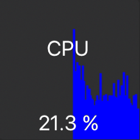
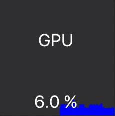
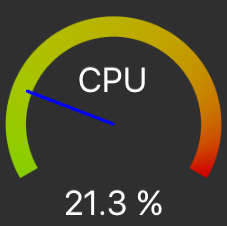
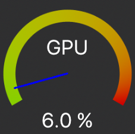
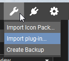
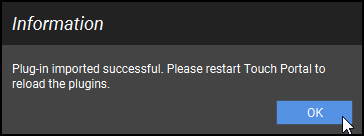
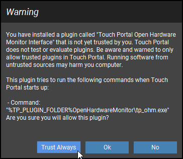

# Touch Portal Plugin for Open Hardware Monitor

TouchPortal Plugin to Utilize Statistics from Open Hardware Monitor - for Windows

- [Touch Portal Plugin for Open Hardware Monitor](#touch-portal-plugin-for-open-hardware-monitor)
  - [Current Sensors and Values Available](#current-sensors-and-values-available)
        - [Data Types](#data-types)
      - [CPU](#cpu)
      - [GPU](#gpu)
      - [RAM](#ram)
  - [Gauges and Graphs ++New in v4](#gauges-and-graphs-new-in-v4)
  - [Sample Page](#sample-page)
  - [Sample Buttons for Bargraphs and Gauges ++New in v4](#sample-buttons-for-bargraphs-and-gauges-new-in-v4)
  - [Events](#events)
  - [Getting Started](#getting-started)
  - [Prerequisites](#prerequisites)
  - [Installing](#installing)
  - [Updating](#updating)
    - [** Note for v6 **](#-note-for-v6-)
  - [Settings](#settings)
  - [Troubleshooting](#troubleshooting)
  - [Notes](#notes)
  - [Built With](#built-with)
  - [Build It](#build-it)
  - [Versioning](#versioning)
  - [Authors](#authors)
  - [License](#license)
  - [Acknowledgments](#acknowledgments)

## Current Sensors and Values Available

__*NOTICE*__: Not all sensors configured will work with your computer, there may be some that don't show anything, and other sensors that I didn't know about were even available so have to be configured to work.  If there is one I missed open an Issue with your attached OHM report and the sensor you are requesting and it will get put on the log.

These are the current sensors and values available via this plugin. This information will be transmitted back to Touch Portal every 1 seconds. If this becomes a problem I'll probably extract this out into a configuration file so it can be controlled by you.

##### Data Types

- Percentage - values 0.0 - 100.0
- Treshold - Coded by sensor and documented below to return "grouped" status data
- SmallData - values are in MB
- Data - values are in GB
- Clock - values are in MHz
- Temperature - values are in °C
- Power - values are in W (watts)

_Note: All Decimals are to the tenths place. I chose not to include the symbol and only the numbers so you can choose how they display_

#### CPU

- **Total CPU Load** - Percentage
  - state id is `tpohm_cpu_total_load_val`
- **CPU Status** (based on Total Load) - Threshold
  - state id is `tpohm_cpu_total_load_status`
    - Final Values are: `Low, Medium, High`
      - `Low` is when &lt; 45% of CPU is used
      - `Medium` is when &lt; 85% of CPU is used
      - `High` is when &gt;= 85% of CPU is used
- **CPU Core Load Values 1-16 Cores** - Percentage
  - state ids are `tpohm_cpu_core_1_load_val` - `tpohm_cpu_core_16_load_val`
- **CPU Core Clock Values 1-16 Cores** - Clock
  - state ids are `tpohm_cpu_core_1_clock_val` - `tpohm_cpu_core_1_clock_val`
- **CPU Package Temperature** - Temperature
  - state id is `tpohm_cpu_package_temp_val`
- **CPU Package Temperature Status** - Threshold
  - state id is `tpohm_cpu_package_temp_status`
    - Final Values are: `Low, Medium, High`
      - `Low` is when &lt; 45°C
      - `Medium` is when &lt; 65°C
      - `High` is when &gt;= 65°C
- **CPU Package Power** - Power
  - state id is `tpohm_cpu_package_power_val`

#### GPU

- **Total GPU Load** - Percentage
  - state id is `tpohm_gpu_core_load_val`
- **GPU Status** (based on Total GPU Load) - Threshold
  - state id is `tpohm_gpu_core_load_status`
    - Final Values are: `Low, Medium, High`
      - `Low` is when &lt; 45% of GPU is used
      - `Medium` is when &lt; 85% of GPU is used
      - `High` is when &gt;= 85% of GPU is used
- **Total GPU Memory Load** - Percentage
  - state id is `tpohm_gpu_memory_load_val`
- **GPU Memory Status** (based on Total GPU Memory Load) - Threshold
  - state id is `tpohm_gpu_memory_load_status`
    - Final Values are: `Low, Medium, High`
      - `Low` is when &lt; 40% of GPU Memory is used
      - `Medium` is when &lt; 85% of GPU Memory is used
      - `High` is when &gt;= 85% of GPU Memory is used
- **GPU Core Clock** - Clock
  - state id is `tpohm_gpu_core_clock_val`
- **GPU Memory Clock** - Clock
  - state id is `tpohm_gpu_memory_clock_val`
- **GPU Shader Clock** - Clock
  - state id is `tpohm_gpu_shader_clock_val`
- **GPU Core Temperature** - Temperature
  - state id is `tpohm_gpu_core_temp_val`
- **GPU Core Temperature Status** - Threshold
  - state id is `tpohm_gpu_core_temp_status`
    - Final Values are: `Low, Medium, High`
      - `Low` is when &lt; 40°C
      - `Medium` is when &lt; 60°C
      - `High` is when &gt;= 60°C
- **GPU Power** - Power
  - state id is `tpohm_gpu_power_val`
- **GPU Memory Free** - SmallData
  - state id is `tpohm_gpu_free_memory_val`
- **GPU Memory Used** - SmallData
  - state id is `tpohm_gpu_used_memory_val`
- **GPU Memory Temperature** - Temperature - Maybe AMD Only
  - state id is `tpohm_gpu_memory_temp_val`
- **GPU Memory Temperature Status** - Threshold - Maybe AMD Only
  - state id is `tpohm_gpu_memory_temp_status`
    - Final Values are: `Low, Medium, High`
      - `Low` is when &lt; 40°C
      - `Medium` is when &lt; 60°C
      - `High` is when &gt;= 60°C

#### RAM

- **Total Memory Load** - output the raw current percentage (to 1 decimal point) of Memory Load
  - state id is `tpohm_memory_load_val`
    - Values are: 0.0 - 100.0
- **Memory Status** (based on Total Load) - called a Threshold in the code
  - state id is `tpohm_memory_load_status`
    - Final Values are: `Low, Medium, High`
      - `Low` is when &lt; 40% of Memory is used
      - `Medium` is when &lt; 85% of Memory is used
      - `High` is when &gt;= 85% of Memory is used
- **Used Memory** - Data
  - state id is `tpohm_used_memory_val`
- **Available Memory** - Data
  - state id is `tpohm_avail_memory_val`

## Gauges and Graphs ++New in v4

With the SDK update to 2 and 2.2 of Touch Portal being released, you can now have images sent from plugins back to Touch Portal.

So with that I wanted to test out (minimal at first) with a few different options. 

**CPU and GPU Load Bar Graph**

You can now have an icon updated on your screen with a bar graph representation of each reading from OHM. This is accomplished by using this action and event combination on the button you want to have the icon shown on.




*NOTE*: This updates every time the plugin runs an update, so again if your mobile device is struggling, maybe increase the time between sends in the config file.

**CPU and GPU Load Gauge**

You can now have an icon updated on your screen with a gaguge representation of each reading from OHM. This is accomplished by using this action and event combination on the button you want to have the icon shown on.




*NOTE*: Unlike the bar graph, this only updates if the previous value is different than the next read value.

## Sample Page

I have created a sample page that can be imported directly into Touch Portal and consume all possible values state values (feel free to edit how you see fit or just use this as a guide).
Download and import this page: [TP OHM Page](resources/OHM%20Page%20Example.tpz)


Here is a gif of it in action on my phone (*note:* slightly different than existing page):


## Sample Buttons for Bargraphs and Gauges ++New in v4

These are all 1x1 buttons but were on a 4 x 3 landscape screen

CPU Load Gauge - import this button: [TP OHM CPU Load Gauge Button](resources/tp_ohm_cpu_load_gauge.tpb)

CPU Load Bargraph - import this button: [TP OHM GPU Load Bargraph Button](resources/tp_ohm_cpu_load_bargraph.tpb)

GPU Load Gauge - import this button: [TP OHM GPU Load Gauge Button](resources/tp_ohm_gpu_load_gauge.tpb)

GPU Load Bargraph - import this button: [TP OHM GPU Load Bargraph Button](resources/tp_ohm_gpu_load_bargraph.tpb)


## Events

Events have been removed in favor of "When plugin state changes" event built into Touch Portal
With the customization of settings, those have become irrelevant.

Any of your buttons that work with them should be converted to use "When plugin state changes" events and 
the subsequent configured values that are defaulted, or set by you in the new Settings

## Getting Started

If you use [Touch Portal](https://touch-portal.com) and are interested in having a "dashboard" display of some base computer statistics, these instructions will help get that setup for you.

If you don't use Touch Portal - how dare you, you should!

## Prerequisites

Download and run Open Hardware Monitor - you can find it here: https://openhardwaremonitor.org/
Current tested version is 0.9.5

Location of where it is downloaded and run from do not matter, as long as it is running and writing sensor data it can run from anywhere on the computer.

After download, run the OpenHardwareMonitor.exe file, for this plugin to run correctly, please enable the following "Options" menu items:


## Installing

_**NOTE**_: Default install path is dictated by Touch Portal, for newer users it is in %APPDATA%\TouchPortal\plugins, for older users it is in C:\Users\(window user name)\Documents\TouchPortal\plugins\ (or wherever your documents folder is)

**Step 1** Make sure you have Open Hardware Monitor installed - go to Prequisites if you did not install it

**Step 2** Download the Touch Portal Plugin [TP_OHM_Plugin.tpp](installer/TP_OHM_Plugin.tpp) file from the github repo installer folder. This contains everything needed for TouchPortal and the Plugin

**Step 3** Open Touch Portal GUI, go to the Wrench, and chose "Import plug-in"



**Step 4** Navigate to where youd downloaded the .tpp file from Step 1, select it and click "Open"

**Step 5** You then should see this, click "Okay"



**Step 6** Now restart the Touch Portal app

 &nbsp;&nbsp;&nbsp;&nbsp;&nbsp;&nbsp; _**NOTE**_: Make sure you fully close Touch Portal using System Tray icon to exit

**Step 7** After Touch Portal is back open and this is your first time installing TP Open Hardware Monitor you will be presented with a "trust" screen - code here is all open source - if you trust the plugin, select "Trust Always" or else everytime you open the app it will ask you:



**Step 8** Now that we are trusted, click on an empty button and if you scroll down in the "Add Actions" list, you should see:


**Step 8** Now you can move onto the Sample Page or start creating your own buttons to use this data.

## Updating

### ** Note for v6 ** 
As noted in the [Events](#events) section, all events have been removed in favor of "When plug-in state changes" event. 
New settings have been put in place to allow for user configuration of the thresholds and cut off ranges. 
see the [Settings](#settings) section for more details

## Settings
Configuration has moved to use the Touch Portal settings section instead of it's own config file.
The new settings will allow for better customization of the threshold levels, and wording
and also be able to configure gauges and bargraphs independently from each other.


## Troubleshooting

Touch Portal will log that it attempted to load the plugin in it's log file
%APPDATA%\TouchPortal\log.txt

when it loads the Plugin it should look like this

```
00:48:02 - [LOG] (Plugin System) Searching and loading plugins...
00:48:02 - [LOG] (Plugin System) (127.0.0.1) Waiting for request on port 12136...
00:48:02 - [LOG] (Plugin System) Added Category: Open Hardware Monitor Info
```

and a little lower you should see something like this:

```
00:48:08 - [LOG] (Plugin System) Executing plugin service: "C:\Users\<USERNAME>\AppData\Roaming\TouchPortal\plugins\OpenHardwareMonitor\tp_ohm.exe"
```

There is also a logfile under the OpenHardwareMonitor plugin folder, %APPDATA%\TouchPortal\plugins\OpenHardwareMonitor\tp_ohm.log

```
[START] tp_ohm is starting up, and about to connect
[FATAL] Cannot create socket connection : ##
```
- Verify your Touch Portal is actually running

```
[START] tp_ohm is starting up, and about to connect
[FATAL] Unable to connect to WMI...
```

- Verify you followed the Prequisite section and installed Open Hardware Monitor, otherwise your user may not have access to read from WMI - please follow [this link](https://docs.bmc.com/docs/display/public/btco100/Setting+WMI+user+access+permissions+using+the+WMI+Control+Panel), but for OpenHardwareMonitor folder instead of CIMV2 to set your user up to access WMI

If you do not see those messages, make sure you followed the Prerequisites section, otherwise visit the #tp-ohm channel on the Touch Portal Discord and we can troubleshoot it when I'm available

_INFO: more notes will be added here as we have to troubleshoot_

## Notes

- this has only been tested on Windows 10 Pro, your mileage my vary
- this was tested on a single CPU Desktop machine, your mileage may vary.
- If you experience issues with the plugin please submit an issue with a saved copy of your Open Hardware Monitor report (File -> Save Report), and it will be reviewed as time permits

## Built With

- [StrawberryPerl](http://strawberryperl.com/) - Coding Language
- [PAR::Packaging](https://metacpan.org/pod/pp) - EXE Packaging Utility
- [Win32::OLE](https://metacpan.org/pod/Win32::OLE) - Used to access the WMI information

## Build It

Building reqiures Par::Packaging (pp) for Perl - and to be located in the src/perl directory of the project

put the below all into a build.bat script that handles this all it is in the root directory (no more remembering for me!)

```shell
@ECHO OFF

cd src\perl

start "Build Perl" cmd /c pp @libs.txt tp_ohm.pl -o tp_ohm.exe

:loop
ping -n 2 localhost >nul 2>nul
tasklist /fi "WINDOWTITLE eq Build Perl" | findstr "cmd" >nul 2>nul && set Child1=1 || set Child1=
if not defined Child1 goto endloop
goto loop
:endloop

move tp_ohm.exe ..\OpenHardwareMonitor\tp_ohm.exe
cd ..
del ..\installer\OpenHardwareMonitor.tpp
7z a -tzip ..\installer\OpenHardwareMonitor.tpp OpenHardwareMonitor
del OpenHardwareMonitor\tp_ohm.exe

```

## Versioning

We use [SemVer](http://semver.org/) for versioning. For the versions available, see the [tags on this repository](https://github.com/spdermn02/tpohm_plugin/tags).

## Authors

- **Jameson Allen** - _Initial work_ - [Spdermn02](https://github.com/spdermn02)

## License

This project is licensed under the GNU General Public License v3.0 - see the [LICENSE](LICENSE) file for details

## Acknowledgments

- Thank you to Open Hardware Monitor for writing your statstics somewhere accessible
- Thank you to Ty and Reinier for creating and developing Touch Portal
